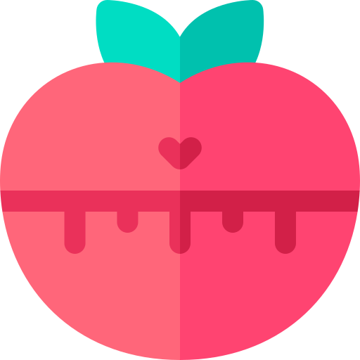
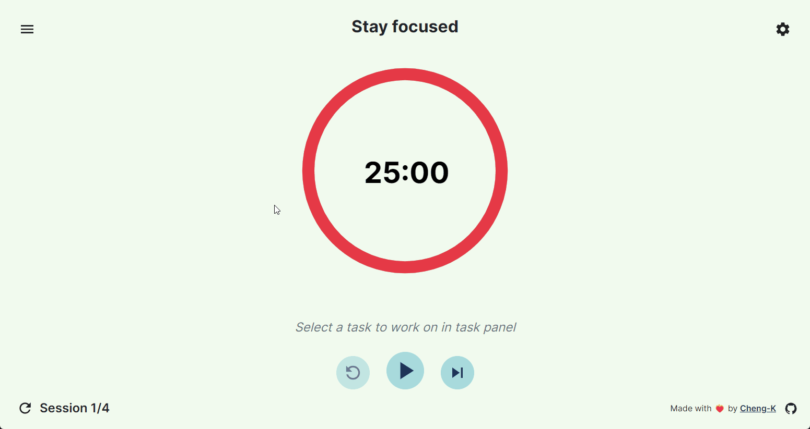
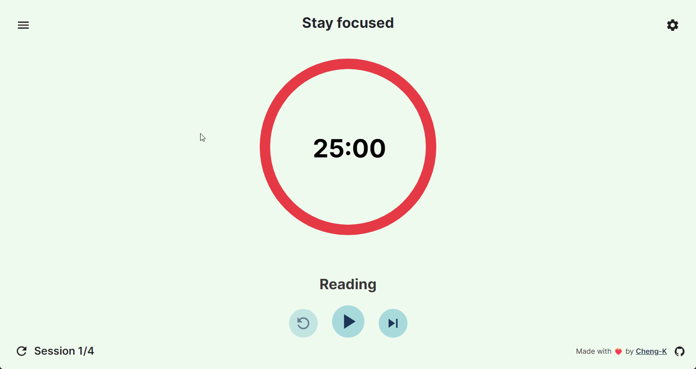
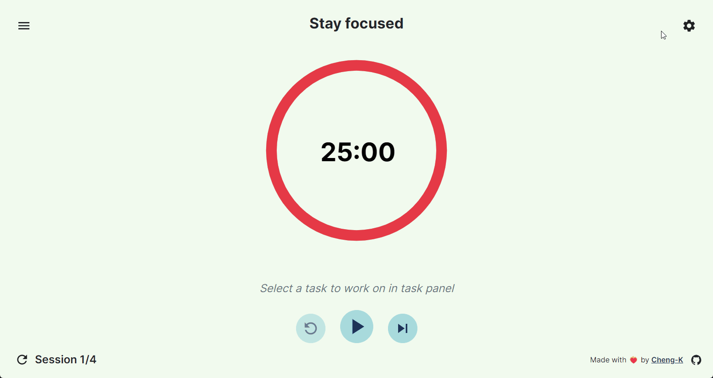
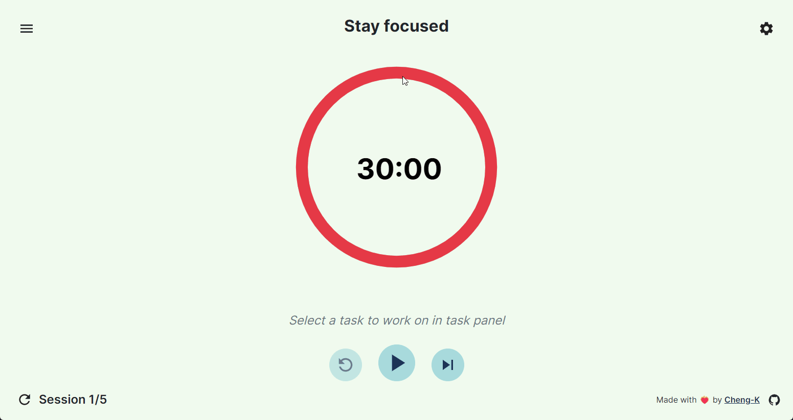

<a name="readme-top"></a>

<!-- PROJECT LOGO -->
<br />
<div align="center">
  <a href="https://github.com/Cheng-K/pomodoro-timer">
    
  </a>

  <h3 align="center">Pomodoro-Timer</h3>

  <p align="center">
    A pomodoro timer to manage your tasks and time better
    <br />
    <br />
    <a href="https://cheng-k.github.io/pomodoro-timer/">View Demo</a>
    ·
    <a href="https://github.com/Cheng-K/pomodoro-timer/issues">Report Bug</a>
    ·
    <a href="https://github.com/Cheng-K/pomodoro-timer/issues">Request Feature</a>
  </p>
</div>

<!-- TABLE OF CONTENTS -->
<details>
  <summary>Table of Contents</summary>
  <ol>
    <li>
      <a href="#about-the-project">About The Project</a>
      <ul>
        <li><a href="#built-with">Built With</a></li>
      </ul>
    </li>
    <li>
      <a href="#getting-started">Getting Started</a>
      <ul>
        <li><a href="#prerequisites">Prerequisites</a></li>
        <li><a href="#installation">Installation</a></li>
      </ul>
    </li>
    <li><a href="#usage">Usage</a>
      <ul>
        <li><a href="#adding-task">Adding task</a></li>
        <li><a href="#editing-task">Editing task</a></li>
        <li><a href="#starting-timer">Starting timer</a></li>
        <li><a href="#show-completed-task">Show completed task</a></li>        
        <li><a href="#changing-settings">Changing settings</a></li>        
        <li><a href="#deleting-all-tasks">Deleting all tasks</a></li>
      </ul>
    </li>
    <li><a href="#contributing">Contributing</a></li>
    <li><a href="#license">License</a></li>
    <li><a href="#contact">Contact</a></li>
    <li><a href="#acknowledgments">Acknowledgments</a></li>
  </ol>
</details>

<!-- ABOUT THE PROJECT -->

## About The Project

[![Pomodoro-Timer Screen Shot][home-screenshot]](https://cheng-k.github.io/pomodoro-timer/)

Pomodoro-Timer is a productivity web application that comes with a todo list and a timer to help users track their work while using the pomodoro technique.

<p align="right">(<a href="#readme-top">back to top</a>)</p>

### Built With

- [![React][react.js]][react-url]
- [![Bootstrap][bootstrap.com]][bootstrap-url]
- [![SASS][sass]][sass-url]
- [![cypress][cypress]][cypress-url]
- [![Vite][vite.js]][vite-url]
- [![JavaScript][javascript]][javascript-url]
- [![NodeJS][node.js]][nodejs-url]

<p align="right">(<a href="#readme-top">back to top</a>)</p>

<!-- GETTING STARTED -->

## Getting Started

The steps below shows the installation process to self-host and make changes to the project.
To get a local copy up and running follow these simple example steps.

### Prerequisites

- NodeJS >= 18
- npm

### Installation

1. Clone the repo
   ```
   git clone https://github.com/Cheng-K/pomodoro-timer.git
   ```
2. Install dependencies via NPM
   ```
   cd pomodoro-timer
   npm install
   ```
3. Launch development server with Vite
   ```
   npm run dev
   ```

<p align="right">(<a href="#readme-top">back to top</a>)</p>

<!-- USAGE EXAMPLES -->

## Usage

### Adding task


### Editing task


### Starting timer



### Show completed task



### Changing settings



### Deleting all tasks



<p align="right">(<a href="#readme-top">back to top</a>)</p>

<!-- CONTRIBUTING -->

## Contributing

Any contributions you make are **greatly appreciated**.

If you have a suggestion that would make this better, please fork the repo and create a pull request. You can also simply open an issue with the tag "enhancement".
Don't forget to give the project a star! Thanks again!

1. Fork the Project
2. Create your Feature Branch (`git checkout -b feature/AmazingFeature`)
3. Commit your Changes (`git commit -m 'Add some AmazingFeature'`)
4. Push to the Branch (`git push origin feature/AmazingFeature`)
5. Open a Pull Request

<p align="right">(<a href="#readme-top">back to top</a>)</p>

<!-- LICENSE -->

## License

Distributed under the MIT License. See `LICENSE.txt` for more information.

<p align="right">(<a href="#readme-top">back to top</a>)</p>

<!-- CONTACT -->

## Contact

Cheng Kei Ong - chengkei.ong@outlook.com - [![LinkedIn][linkedin-shield]][linkedin-url]

Project Link: [https://cheng-k.github.io/pomodoro-timer/](https://cheng-k.github.io/pomodoro-timer/)

<p align="right">(<a href="#readme-top">back to top</a>)</p>

<!-- ACKNOWLEDGMENTS -->

## Acknowledgments

- [Best-README-Template](https://github.com/othneildrew/Best-README-Template)
- [Choose an Open Source License](https://choosealicense.com)
- [GitHub Pages](https://pages.github.com)
- [Img Shields](https://shields.io)
- [Pomodoro icons created by Freepik - Flaticon](https://www.flaticon.com/free-icons/pomodoro)
- [React Icons](https://react-icons.github.io/react-icons/search)

<p align="right">(<a href="#readme-top">back to top</a>)</p>

<!-- MARKDOWN LINKS & IMAGES -->
<!-- https://www.markdownguide.org/basic-syntax/#reference-style-links -->

[linkedin-shield]: https://img.shields.io/badge/linkedin-%230077B5.svg?style=for-the-badge&logo=linkedin&logoColor=white
[linkedin-url]: https://www.linkedin.com/in/chengkei-ong
[home-screenshot]: images/home.png
[react.js]: https://img.shields.io/badge/React-20232A?style=for-the-badge&logo=react&logoColor=61DAFB
[react-url]: https://reactjs.org/
[bootstrap.com]: https://img.shields.io/badge/Bootstrap-563D7C?style=for-the-badge&logo=bootstrap&logoColor=white
[bootstrap-url]: https://getbootstrap.com
[sass]: https://img.shields.io/badge/SASS-hotpink.svg?style=for-the-badge&logo=SASS&logoColor=white
[sass-url]: https://sass-lang.com/
[cypress]: https://img.shields.io/badge/-cypress-%23E5E5E5?style=for-the-badge&logo=cypress&logoColor=058a5e
[cypress-url]: https://www.cypress.io/
[vite.js]: https://img.shields.io/badge/vite-%23646CFF.svg?style=for-the-badge&logo=vite&logoColor=white
[vite-url]: https://vitejs.dev/
[javascript]: https://img.shields.io/badge/javascript-%23323330.svg?style=for-the-badge&logo=javascript&logoColor=%23F7DF1E
[javascript-url]: https://developer.mozilla.org/en-US/docs/Web/JavaScript
[node.js]: https://img.shields.io/badge/node.js-6DA55F?style=for-the-badge&logo=node.js&logoColor=white
[nodejs-url]: https://nodejs.org
